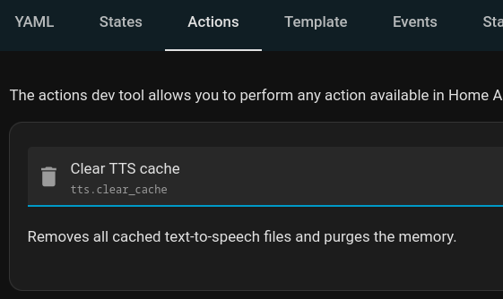

# Wyoming Piper

[Wyoming protocol](https://github.com/rhasspy/wyoming) server for the [Piper](https://github.com/rhasspy/piper/) text to speech system.

## Home Assistant Add-on

[](https://my.home-assistant.io/redirect/supervisor_addon/?addon=core_piper)

[Source](https://github.com/home-assistant/addons/tree/master/piper)

## Local Install

Clone the repository and set up Python virtual environment:

``` sh
git clone https://github.com/rhasspy/wyoming-piper.git
cd wyoming-piper
script/setup
```

Install Piper
```sh
curl -L -s "https://github.com/rhasspy/piper/releases/download/v1.2.0/piper_amd64.tar.gz" | tar -zxvf - -C /usr/share
```

Run a server that anyone can connect to:

``` sh
script/run --piper '/usr/share/piper/piper' --voice en_US-lessac-medium --uri 'tcp://0.0.0.0:10200' --data-dir /data --download-dir /data 
```

## Docker Image

``` sh
docker run -it -p 10200:10200 -v /path/to/local/data:/data rhasspy/wyoming-piper \
    --voice en_US-lessac-medium
```

[Source](https://github.com/rhasspy/wyoming-addons/tree/master/piper)

## Static Sentences
For non-english speakers, some TTS models do not offer a good pronunciation or in general enough tone consistency.

To avoid this, one can pre-generate sentences with bigger models or using paid services, download them and let Piper forward those instead of the auto-generated voice.

Static sentences _do not_ prevent Piper text generation: sentences which are not mapped (see the following sections) will be generated by Piper as usual.

For example, suppose you have a device called "lamp". You could generate a "turned on lamp" sentence and have Piper forward that instead of generating the sentence on the fly.

To accomplish this:
- enable static sentences (using `--use-static-sentences`)
- provide the static sentences folder to the script (using `--static-sentences-dir`)
- create a _static-sentences.json_ file in the static sentences folder by mapping each sentence with the path of the audio (_.wav_) to play. __The file name must not be changed.__

Keep in mind that the `static-sentences.json` file will be parsed as follows:
- keys:
    - leading and trailing spaces will be removed
    - leading and trailing punctuation will be removed
    - text will be made lowercase
- values:
    - relative paths will be inferred as originating from the static sentences folder (e.g. _lamp.wav_ -> _/static-sentences/lamp.wav_)

__Important__: Keys are preprocessed the same way as the text to be synthetised, so there is no risk of spaces, punctuation or casing getting in the way of correctly selecting a static sentence.

### Docker
Use the same parameters and mount the static sentences dir as a volume.

### HomeAssistant
HomeAssistant caches TTS output audios. If you've used Assist previously, make sure you clear TTS cache via _Developer Tools_:



### Example static-sentences.json
Suppose you have the following folder structure:

```md
.
├── ...
└── static-sentences/
    ├── static-sentences.json
    ├── on/
    |   ├── lamp.wav
    |   ├── ...
    |   └── heating.wav
    └── off/
        ├── lamp.wav
        ├── ...
        └── heating.wav
```

Then a valid _static-sentences.json_ could be as follows:
```json
{
  "turned on lamp": "on/lamp.wav",
  "turned off heating": "off/heating.wav"
}
```

In this case, `--static-sentences-dir` shall be set to _static-sentences_.